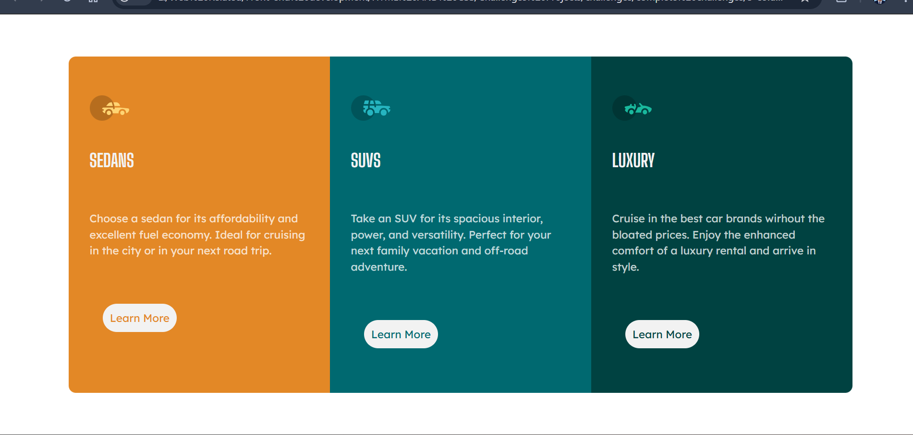

# Frontend Mentor - Car Rental Service Landing Page

This is a solution to the [Car Rental Service Landing Page challenge on Frontend Mentor](https://www.frontendmentor.io/challenges/car-rental-service-landing-page). Frontend Mentor challenges help you improve your coding skills by building realistic projects.

## Table of Contents

- [Overview](#overview)
  - [The Challenge](#the-challenge)
  - [Screenshot](#screenshot)
  - [Links](#links)
- [My Process](#my-process)
  - [Built With](#built-with)
  - [What I Learned](#what-i-learned)
  - [Continued Development](#continued-development)
  - [Useful Resources](#useful-resources)
- [Author](#author)
- [Acknowledgments](#acknowledgments)

## Overview

### The Challenge

The challenge was to create a responsive landing page for a car rental service. The page should include sections for different types of vehicles (sedans, SUVs, and luxury cars) and provide a user-friendly interface for potential customers to learn more about each option.

### Screenshot

### Links

- [Solution URL](https://github.com/yourusername/your-repo-name)
- [Live Site URL](https://yourusername.github.io/your-repo-name)

## My Process

### Built With

- Semantic HTML5 markup
- CSS custom properties
- Flexbox
- CSS Grid
- Mobile-first workflow
- [Google Fonts](https://fonts.google.com/) - For fonts

### What I Learned

While working on this project, I reinforced my understanding of responsive design principles and CSS layout techniques. I also practiced creating a visually appealing and user-friendly interface.

### Continued Development

In future projects, I aim to focus more on accessibility and performance optimization. I also plan to explore more advanced CSS and JavaScript techniques to enhance user interaction.

### Useful Resources

- [MDN Web Docs](https://developer.mozilla.org/) - This helped me with understanding HTML and CSS properties.
- [CSS-Tricks](https://css-tricks.com/) - This is an amazing resource for CSS tips and tricks.

## Author

- Website - [Your Name](https://www.yourwebsite.com)
- Git Hub - [@yourusername](https://github.com/Farhan-MHD)
- Twitter - [@yourtwitterhandle](https://www.twitter.com/yourtwitterhandle)

## Acknowledgments

I would like to thank Frontend Mentor for providing this challenge, which helped me improve my front-end development skills.
